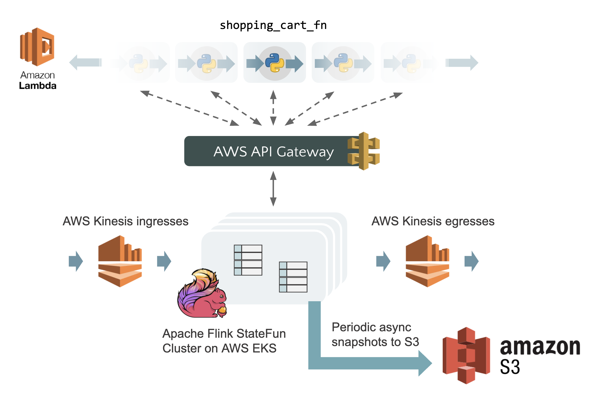

# Stateful Serverless App with Stateful Functions and AWS

This is a complementary demo application to go with the Apache Flink community blog post, [Stateful Functions Internals: Behind the scenes of Stateful Serverless](https://flink.apache.org/news/2020/10/11/stateful-serverless-internals.html), which walks you through the details of [Stateful Functions'](https://ci.apache.org/projects/flink/flink-statefun-docs-master/) runtime.

The demo is a simple shopping cart application, whose architecture consists of the following parts:
* Functions written using Stateful Functions' [Python SDK](https://ci.apache.org/projects/flink/flink-statefun-docs-master/sdk/python.html), serviced via [AWS Lambda](https://aws.amazon.com/lambda/) and [AWS API Gateway](https://aws.amazon.com/api-gateway/) as a serverless deployment.
* A StateFun cluster running on Kubernetes ([AWS EKS](https://aws.amazon.com/eks/)), playing the role of an [event-driven database](https://flink.apache.org/news/2020/04/07/release-statefun-2.0.0.html#an-event-driven-database) that manages state and message routing for the serverless functions.
* [AWS Kinesis](https://aws.amazon.com/kinesis/) streams serving as the ingress and egress of application events.
* An [AWS S3](https://aws.amazon.com/s3/) bucket to persist periodic checkpoints of the function states for durability and fault-tolerance.



Please refer to the blog post for further details.

## Project structure

* `app/`: Contains the function code that defines the business logic, written as AWS Lambda functions.
* `protobuf/`: Contains Protobuf definitions of the message and state types that the functions use.
* `Dockerfile`: Dockerfile for building the image that will be used to deploy the StateFun cluster.
* `k8s/`: Contains Helm templates to deploy the StateFun cluster on Kubernetes.
* `build-*.sh`: Tool scripts for preparing deployment resources, such as AWS Lambda packages and Kubernetes deployment templates.

## Running the demo

### Prerequisities

* Have Helm, Docker, and `kubectl` installed.
* A running Kubernetes cluster with access to AWS Kinesis and AWS S3. This demo assumes that you are using AWS EKS, which would contain the necessary credentials in the cluster node environments.
* Created AWS Kinesis streams `cart_events` and `cart_results`.
* A S3 bucket for persisting periodic checkpoints. The tutorial below assumes you've created the bucket at `s3:///checkpoints/`. 

### Procedures

#### Step 1: Package and upload the AWS Lambda functions

```
$ ./build_lambda_packages.sh
```

This creates a package at `aws_lambda_package/shopping_cart_lambda_function.zip`.

Once done, you need to:
* Upload the Lambda function. Please see the [AWS Lambda docs](https://docs.aws.amazon.com/lambda/latest/dg/getting-started-create-function.html) on how to do that.
* Service the function by [configuring an API Gateway HTTP endpoint as the Lambda trigger](https://docs.aws.amazon.com/lambda/latest/dg/services-apigateway.html).

After completing this step, you should now have an API endpoint URL (e.g. `https://abcdxyz.execute-api.us-west-1.amazonaws.com/default/shopping-cart`) for invoking the functions.

#### Step 2: Deploy the StateFun cluster on Kubernetes

```
$ ./build_k8s_resources.sh -t <image-tag> -e <lambda-endpoint-url> -c <s3-checkpoint-dir>
```

For example, assuming the resources we've prepared so far:

```
$ ./build_k8s_resources.sh \
    -t tzulitai/statefun-aws-demo \
    -e https://abcdxyz.execute-api.us-west-1.amazonaws.com/default/shopping-cart \
    -s s3:///checkpoints/
```

This builds the Docker image for the StateFun cluster, as well as a `statefun-k8s.yaml` for deploying the cluster.

Once done, you need to:
* Upload the Docker image to the Dockerhub public registry.
* `kubectl create -f statefun-k8s.yaml` to deploy the cluster.
